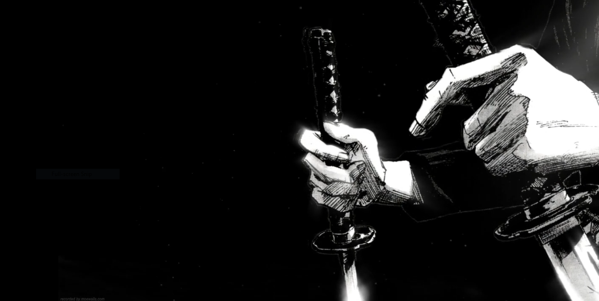

# 🧠 Anime Memory Game

A beautiful, fast, and fun memory card game built with React! Test your memory with your favorite anime heroes from One Piece, My Hero Academia, and Bleach. Choose your anime, pick a level, and see how far you can go!

---

## 🚀 Live Demo

👉 [Play Now on GitHub Pages](https://AkshayPP-3.github.io/memory-game)

👉 [Live on Vercel](https://memory-game-akshaypp-3.vercel.app/)

---

## 🛠️ Features

- 🎴 Multiple anime themes: One Piece, My Hero Academia, Bleach
- 🖼️ Animated video backgrounds with poster images for smooth loading
- 📱 Responsive, retro-inspired UI
- 🧩 Three difficulty levels per anime
- 🔄 Cards shuffle after every click (Medium/Hard)
- 🎵 Themed audio and win/lose popups
- ⚡ Super fast, optimized for web

---

## 📦 Source Code

[GitHub Repository](https://github.com/AkshayPP-3/memory-game)

---

## 📝 How to Play

1. Click the **PLAY** button to start.
2. Choose your favorite anime.
3. Select a level (Easy, Medium, Hard).
4. Click each card only once. If you click the same card twice, you lose!
5. Try to click all unique cards to win and advance to the next level.

---

## ✨ Screenshots

---

## 💻 Tech Stack

- React 19
- Vite
- React Router
- Tailwind CSS
- Deployed on GitHub Pages & Vercel

---

## © 2025 AkshayPP-3

Enjoy the game and may your memory be as strong as your favorite anime hero! 🚢🦸‍♂️🗡️